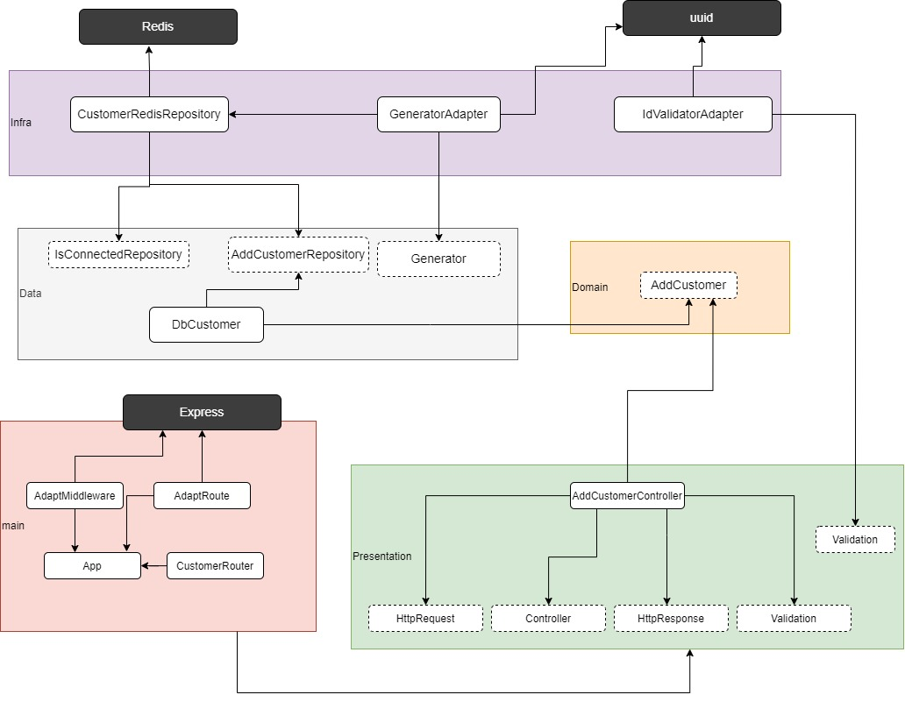
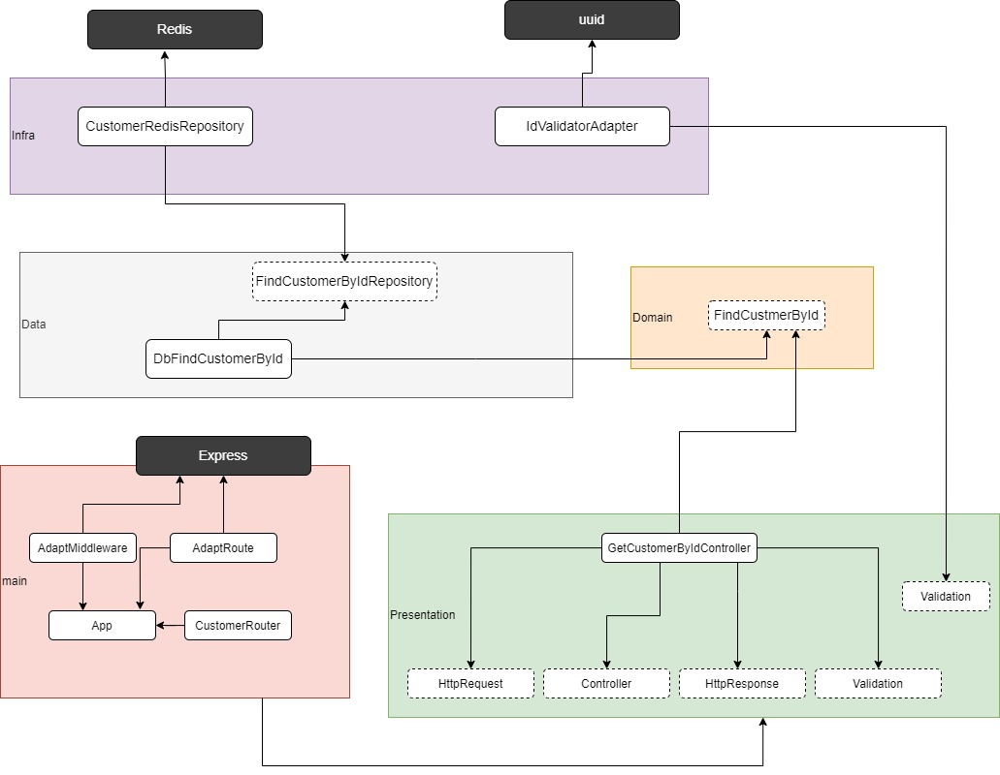

## Desenho da arquitetura 

<blockquote>

**A baixo estão o desenho da arquiteura nos três cenários que foram desenvolvido  (Criar cliente, atualizar cliente e buscar cliente)**

## Criar cliente
 

## Buscar um cliente por id

## Atualizar um cliente

</blockquote>